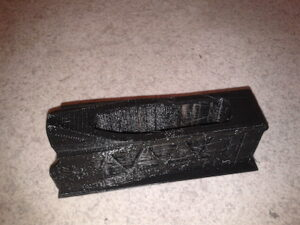
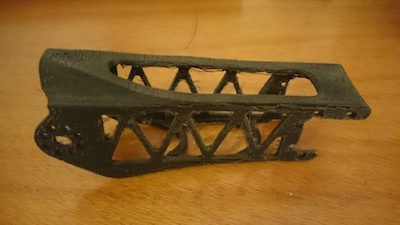
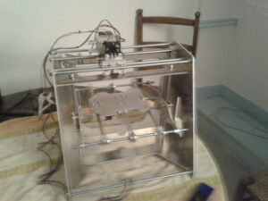
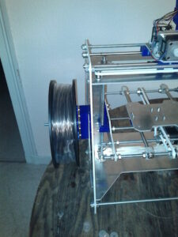
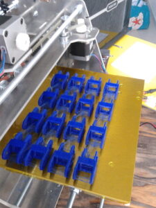
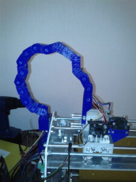

### 3D Printer

I built a 3D printer back in 2011 when 3D printing at home was just beginning.

I started with a rough kit shipped from another maker that I improved in many ways. I added linear roller bearings for the rails, a chain to maintain cables, a holder for the plastic, a case with a fan for the electronics, and other parts to hold things in place. See photos and videos below.

This printer printed the first part of the [Poppy project](https://www.poppy-project.org/) back in early 2012.

---

### First 3D Print (2011)

<iframe width="640" height="360" src="https://www.youtube.com/embed/MCbMIJw1MgE?controls=1&rel=0&playsinline=0&modestbranding=0&cc_load_policy=0&autoplay=0" title="First 3D print at home in 2011" frameborder="0" allow="accelerometer; autoplay; clipboard-write; encrypted-media; gyroscope; picture-in-picture; web-share" allowfullscreen></iframe>

#### Photos

---

### 3D Printing Chain Elements

<iframe width="640" height="360" src="https://www.youtube.com/embed/CK_Ua5wZSkU?controls=1&rel=0&playsinline=0&modestbranding=0&cc_load_policy=0&autoplay=0" title="3D printing chain elements" frameborder="0" allow="accelerometer; autoplay; clipboard-write; encrypted-media; gyroscope; picture-in-picture; web-share" allowfullscreen></iframe>

#### Photos

---

### 3D Printing an Empty Ball

<iframe width="640" height="360" src="https://www.youtube.com/embed/DBdOaJ1qL4U?controls=1&rel=0&playsinline=0&modestbranding=0&cc_load_policy=0&autoplay=0" title="3D printing an empty ball" frameborder="0" allow="accelerometer; autoplay; clipboard-write; encrypted-media; gyroscope; picture-in-picture; web-share" allowfullscreen></iframe>

#### Photos

