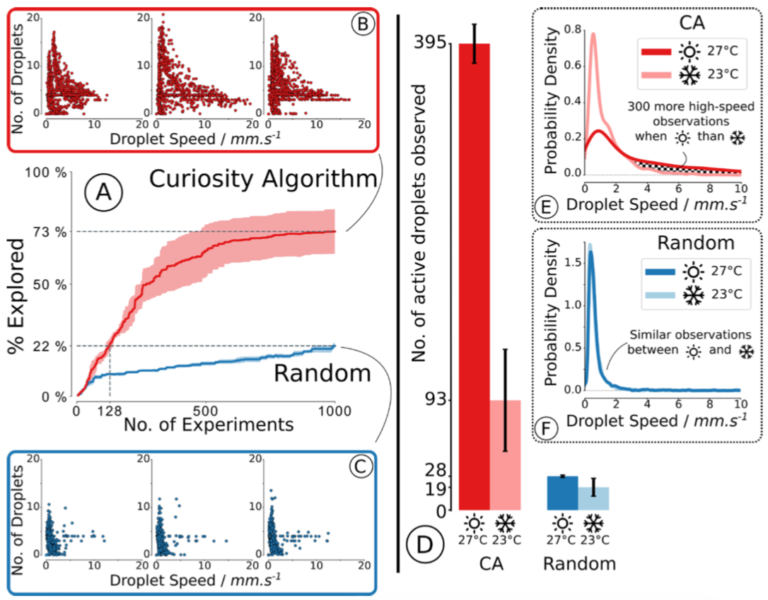
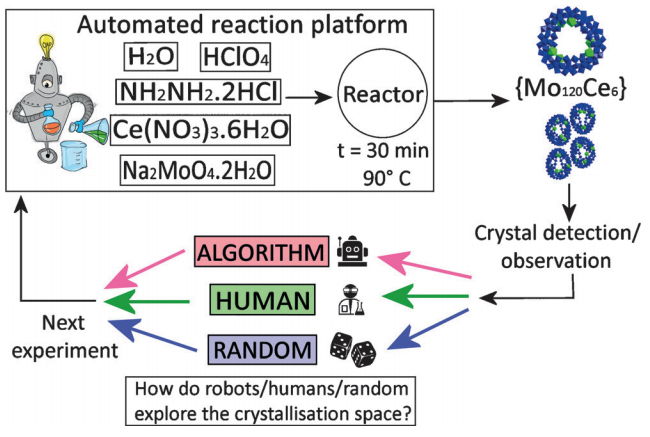
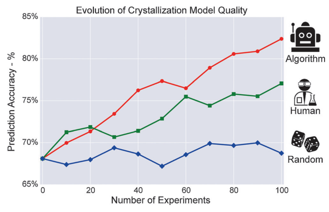
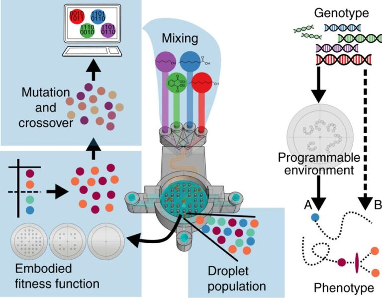
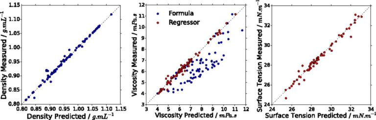

# Applying Machine Learning to the Exploration of Physicochemical Systems

_Last update: January 2019_

*How can AI help make discoveries on the bench in a chemistry lab? How can chemical systems help devise better AI algorithms?*  
I explored those questions with the team I led in the [Cronin Group](http://www.chem.gla.ac.uk/cronin/). The group’s cutting-edge knowledge combined with my experience from the developmental sciences allowed us to bring innovative ideas to the field, including the use of active learning, curiosity-driven exploration, and human comparative studies.

## Videos

### Droplets Compilation
<iframe width="640" height="360" src="https://www.youtube.com/embed/RC_nc0P_crc" frameborder="0" allowfullscreen></iframe>  
_Compilation of droplet behaviors – one of the systems we studied._

### Droplet Robots Compilation
<iframe width="640" height="360" src="https://www.youtube.com/embed/_pAtu3atYN8" frameborder="0" allowfullscreen></iframe>  
_Compilation of robotic platforms designed by the team._

---

## Content

- [Approach](#approach)
- [Team](#team)
- [Projects](#projects)
  - [Curiosity-driven exploration on a laboratory robot](#dropfactory)
  - [Active learning in crystallization experiments](#human-vs-robots)
  - [Hierarchical exploration of gold nanoparticles](#nanobot)
  - [Physical environment as an experiment variable](#flowbot)
  - [AI to better understand self-propelled droplets](#surfbot)
  - [Black-box optimization of self-propelled droplets](#dropbot)
- [Resources](#additional-resources)
- [Personal Notes](#personal-notes)

---

## Approach

I grew frustrated that most AI research was done on simulated environments. I wanted to see this technology used in the real world on systems we do not ourselves design nor understand – that is, not even on robots.

The physical sciences seem fitting. In physics, chemistry, or biology, an important part of everyday research is to understand yet unknown systems. Scientists devise experiments and build instruments to query these systems with the aim of modeling, and later predicting, their evolution.

This is in sharp contrast with simulation, big data, and controlled robotic problems AI algorithms are designed on and for.  
[1] If we ought to bring AI advances to experimental research in labs, we need to drop the habit of thinking that experiments are free, unlimited, and well-defined.

### Connecting Developmental Robotics and Physical Sciences

A subfield of robotics, called [developmental robotics](https://en.wikipedia.org/wiki/Developmental_robotics), imposes similar constraints. Their aim is to build a robot that can learn like a child. This opened an ocean of research directions to bring principles from developmental robotics into the physical sciences.

---

## Team

  
_The Chemobot team from 2015–2018 within the Cronin group, University of Glasgow. Missing: Kevin Donkers._

The team was composed of Lee Cronin (PI), Jonathan Grizou (me), Abhishek Sharma, Jan Szymanski, James W. Taylor, Juan Manuel Parrilla Gutierrez, Laurie J. Points, Vasilios Duros, Sergio Martin Marti, Graham Keenan, and Kevin Donkers. A mix of chemists, computer scientists, and material scientists.

---

## Projects

### Curiosity-Driven Exploration of Oil-in-Water Droplets

<iframe width="640" height="360" src="https://www.youtube.com/embed/bY5OoRBJkf0" frameborder="0" allowfullscreen></iframe>  
The [Dropfactory robot](https://github.com/croningp/dropfactory) is able to perform, record, and clean 8 droplet experiments in parallel.

By applying the CA-robot to the study of self-propelling multicomponent oil-in-water droplets, we observed an order of magnitude more variety of droplet behaviors than possible with a random parameter search given the same budget. We discovered a sudden and highly specific response of droplets to slight temperature changes.

---

**[More information and tools](https://github.com/croningp)**  

## Summary of Results

<figcaption>
Summary of the results. Left: (A) % of explored space. CA explored 3.3 times more than random. (B, C) Observations made by each method for each repeat; each scatter dot represents a single droplet experiment. CA (B) leads to a greater variety of observations than random (C). Right: Effect of temperature. (D) Number of experiments with a speed faster than 3 mms-1. A change of only ca. 4.4°C led to a significant difference in the observed droplet behaviours when using the CA (395 vs 93, p=0.005), which is not observed when using random (28 vs 19, p=0.22). This is confirmed by (E) and (F) which show the distribution of observation. The CA enabled the discovery of the temperature effect.
</figcaption>

---

Once the temperature dependence was discovered, six modes of self-propelled droplet motion were identified and classified using a time-temperature phase diagram and probed using a variety of techniques including NMR, which allowed the design of a payload release system triggered by temperature. This work illustrates how target-free search can significantly increase the rate of unpredictable observations leading to new discoveries with potential applications in formulation chemistry.

### Video: Effect of Temperature on Droplet Motion

<iframe width="640" height="360" src="https://www.youtube.com/embed/80yAmBkzdmM?controls=1&rel=0&playsinline=0&modestbranding=0&cc_load_policy=0&autoplay=0" frameborder="0" allowfullscreen></iframe>

---

## Resources

1. **A curious formulation robot enables the discovery of a novel protocell behavior.**  
   Grizou, J., Points, L. J., Sharma, A. & Cronin, L. (2020). *Science Advances*.  
   [PDF](https://advances.sciencemag.org/content/6/5/eaay4237.full.pdf) | [DOI](https://doi.org/10.1126/sciadv.aay4237) | [Robot Design](https://github.com/croningp/dropfactory) | [Experiment Code](https://github.com/croningp/dropfactory_exploration) | [Analysis Code](https://github.com/croningp/dropfactory_analysis) | [Project](https://jgrizou.github.io/website/projects/chemobot#dropfactory)

---

## Human vs Robots

The discovery of new gigantic molecules formed by self-assembly and crystal growth is challenging as it combines two contingent events: the formation of a new molecule and its crystallization. We constructed an automated workflow that can probe both events and employed it for a new polyoxometalate cluster which has a trigonal-ring type architecture.

### Representation of Methods

  
Representation of the experimental method showing how the automated and bench work was done.

  
Schematic diagram of the exploration methods. All experiments are performed on a crystallization robotic platform.

---

A critical constraint was that we could only perform 10 experiments per day. We ran the active learning in batches of 10 experiments, performing 10 iterations for a total of 100 experiments per method and repeat. This required 10 days and significant reagents to validate the approach for the first time. The results showed that the active learning algorithmic search increased the crystallization prediction accuracy to **82.4 ± 0.7%** compared to **77.1 ± 0.9%** from human experimenters given the same experimental budget.

### Results

  
Average for the crystallization prediction accuracy between the classes of crystals and non-crystals for the three methods, using a RandomForest classifier.

---

## Additional Resources

1. **Intuition-enabled Machine Learning beats the Competition when Joint Human-Robot Teams perform Inorganic Chemical Experiments.**  
   Duros, V., Grizou, J., Sharma, A., Mehr, S.H.M., et al. (2019). *Journal of Chemical Information and Modeling*.  
   [PDF](https://pubs.acs.org/doi/pdf/10.1021/acs.jcim.9b00304) | [Journal](https://pubs.acs.org/doi/abs/10.1021/acs.jcim.9b00304) | [Project](https://jgrizou.github.io/website/projects/chemobot#human-vs-robots)

2. **Human vs Robots in the Discovery and Crystallization of Gigantic Polyoxometalates.**  
   Grizou, J., Duros, V., Xuan, W., et al.

   

After several cycles and the application of a genetic algorithm (GA), the fitness factor at each stage increased every generation leading towards the desired outcome. Our system could synthesise recursively gold nanospheres, gold nanorods (AuNRs), and arrow-headed gold nanorods with high reproducibility.

_Left: Evolution of the median fitness per generation. Middle: Comparison between UV-Vis spectrum of particles described in the literature and the best particles obtained with the robot. Right: TEM image of the particles that correspond to the UV-Vis spectrum shown._

Our results show that the evolution of nanomaterials is possible in a fully automated fashion and has the potential to change the way AuNPs are studied and explored.

## Resources
1. **A Nanomaterials Discovery Robot for the Darwinian Evolution of Shape Programmable Gold Nanoparticles.** Keenan, G., Salley, D., Martín, S., Grizou, J., Sharma, A. and Cronin, L. (2020). *Nature Communications.* [PDF](https://www.nature.com/articles/s41467-020-16501-4.pdf) | [DOI](https://doi.org/10.1038/s41467-020-16501-4) | [Project](https://jgrizou.github.io/website/projects/chemobot#nanobot)

### Physical environment as an experiment variable
Evolution via natural selection is governed by the persistence and propagation of living things in an environment. The environment is important since it contributes to shaping evolution. Although evolution has been widely studied in a variety of fields from biology to computer science, still little is known about the impact of environmental changes on an artificial chemical evolving system outside of computer simulations.

We developed a fully automated 3D-printed chemorobotic fluidic system that is able to generate and select droplet protocells in real time while changing the surroundings where they undergo artificial evolution.

_Schematic describing the evolutionary process. In the first step, a computer generates random recipes using ratios of 1-octanol, octanoic acid, 1-pentanol, and diethyl phthalate. These oils are then mixed through a serpentine channel, and populations of five droplets are generated in the evolutionary arena. The droplet behaviours are then analysed and ranked using a fitness function. The best droplets are selected, and new droplet formulations were generated after “mutation” and “crossover” operations._

Compared to our previous work, the use of a 3D-printed device enables us to change the physical environment in which the droplet population evolves. The 3D printed platform also innovates as no moving parts are required to initiate, run, and clean droplet experiments.

_Schematic of the 3D-printed system. Chemical inputs are handled by pumps. Droplet mixtures are formed through a serpentine channel and pushed to form droplets into an evolutionary arena. A camera records the arena from above. Image processing algorithms are used to analyse and categorise the droplet behaviours._

### Videos
- [Trailer of the platform in action](https://youtu.be/RzqkPU0Pa3Q)
- [Droplet recipes evolving through a genetic algorithm in different arenas](https://youtu.be/UJSlCrCaaAo)

Using such 3D-printed devices, we were able to change the physical environment in which the droplet population evolves. We thus explicitly studied how the genotype is modulated through a programmable environment to express its phenotype, in contrast to the more studied genotype-to-phenotype direct approach.

By successively evolving the droplets from one environment to another, we were able to observe disruption in their evolutionary trajectories, as well as adaptation of their genome.

_Environmental change results. Fitness evolution over generation. The first 10 generations used an empty arena, the following 10 generations used an arena filled with pillars, and the last 10 generations used the arena generated using an L-system. The arena was swapped to the pillars environment between the 10th and 11th generation, inducing a drop in the fitness values, which forced the droplet to adapt and evolve again in the new environment. The arena was swapped to the L-system between generations 20 and 21, introducing no noticeable fitness changes._

## Resources

1. **Adaptive artificial evolution of droplet protocells in a 3D-printed fluidic chemorobotic platform with configurable environments.**  
   Parrilla-Gutierrez, J. M., Tsuda, S., Grizou, J., Taylor, J., Henson, A., & Cronin, L. (2017).  
   *Nature Communications, 8(1), 1144.*  
   [PDF](https://www.nature.com/articles/s41467-017-01161-8.pdf) | [Journal](https://www.nature.com/articles/s41467-017-01161-8)

---

### AI as a tool to understand complex systems

Exploring and understanding the emergence of complex behaviors is difficult even in “simple” chemical systems since the dynamics can rest on a knife edge between stability and instability.

We study the dynamics of oil droplets in an aqueous environment using an automated platform equipped with artificial intelligence. Compared to previous work, we increased the number of experimental parameters and allowed the robot to choose both the concentration of oils in the droplets and the concentration of surfactants in the aqueous phase. Our aim was to identify more droplet behaviors and understand better the mechanisms behind them.

---

#### Video: Surfbot - Platform

---

### Operation of the Platform

To test the platform, we started by running evolutionary experiments and comparing them to our previous work.

---

#### Comparison of Median Fitness Values
  
*Comparison of median fitness values per generation between the oil-only, aqueous-only, and aqueous-oil optimizations.*

---

#### Video: Surfbot - Highspeed
  
*Comparison of speed achieved with the oil-only, aqueous-only, and aqueous-oil optimizations.*

---

By opening the parameter space to the chemical environment of the droplets, we were able to generate faster-moving droplets. The recipes and data generated from this process were then used for physicochemical analysis, where traditional chemical analysis, machine learning, and archetypal droplet experiments are used to study the behavioral mechanisms and to predict droplet behaviors.

---

  
*This work combined robotic exploration and AI to identify behaviors with traditional physical chemical analysis augmented with AI.*

---

The data acquired were used to build predictive models of the system, of which no physical model, or only inaccurate models, were available.

---

  
*Plots of the predicted density (Left), dynamic viscosity (Center), and surface tension (Right) against their measured values. Blue points are predicted using weighted mean (density) and Arrhenius-based method (viscosity), while red values are predicted using an SVM regressor.*

---

Physical properties such as viscosity, surface tension, and density are shown to be related to behaviors, as well as to droplet behavioral niches, such as collective swarming. By dying droplets with phenolphthalein, we could observe the internal dynamics within the droplets and depending on their composition. For example, pentanol goes very pink, has rapid flows, and dissolves, while DEP only goes pink at the interface.

---

#### Video: Surfbot - Dye
  
*Dye experiments showing the complex flow of chemicals inside the droplets.*

---

## Resources

1. **Artificial intelligence exploration of unstable protocells leads to predictable properties and discovery of collective behaviorAdaptive artificial evolution of droplet protocells in a 3D-printed fluidic chemorobotic platform with configurable environments.**  
   Laurie J. Points, James Ward Taylor, Jonathan Grizou, Kevin Donkers, and Leroy Cronin (2018).  
   *PNAS, 115(5), 885-890.*  
   [PDF](https://www.pnas.org/doi/epdf/10.1073/pnas.1711089115) | [Journal](https://doi.org/10.1073/pnas.1711089115)

---

### Black Box Optimization of Oil-in-Water Droplets

This work focuses on the optimization of the dynamic properties of droplets on a robotic platform. It was completed before I joined the Cronin group and made me realize it became possible to apply a range of new exploration methods freshly developed in computer science research groups directly on physical systems in the lab.

They presented a liquid-handling robot built with the aim of investigating the properties of oil droplets as a function of composition via an automated evolutionary process. The robot makes the droplets by mixing four different compounds in different ratios and placing them in a Petri dish, after which they are recorded using a camera and the behavior of the droplets is analyzed using image recognition software to give a fitness value.

---

#### Video: Robotic Exploration of Droplets

The first droplet robot made in the Cronin group.

In separate experiments, the fitness function discriminates based on movement, division and vibration over 21 cycles, giving successive fitness increases. Analysis and theoretical modelling of the data yields fitness landscapes analogous to the genotype–phenotype correlations found in biological evolution.

### Resources

**Evolution of oil droplets in a chemorobotic platform.** Gutierrez, J. M. P., Hinkley, T., Taylor, J. W., Yanev, K., & Cronin, L. (2014). *Nature Communications, 5, 5571.* [PDF](https://www.nature.com/articles/ncomms6571.pdf) [Journal](https://www.nature.com/articles/ncomms6571)

## Resources

### Workshop
In 2017, we organized a [workshop](https://croningp.github.io/tutorial_icdl_epirob_2017/) providing an extensive overview of this research. [PDF](https://croningp.github.io/tutorial_icdl_epirob_2017/tutorial_proposal_final.pdf) [Slides](https://github.com/croningp/tutorial_icdl_epirob_2017/releases/tag/slides) [Website](https://croningp.github.io/tutorial_icdl_epirob_2017/)

### Code and tools
We have developed a collection of software and hardware tools that has been made open source to help further research in this area. These tools are described on the [open robotics project page](https://jgrizou.github.io/website/projects/open_robotics/#laboratory-robotics) and available on the [Cronin group GitHub account](https://github.com/croningp).

### Publications

1. **A curious formulation robot enables the discovery of a novel protocell behavior.** Grizou, J., Points, L. J., Sharma, A. & Cronin, L. (2020). *Science Advances.* [PDF](https://advances.sciencemag.org/content/6/5/eaay4237.full.pdf) [DOI](https://doi.org/10.1126/sciadv.aay4237) [Robot Design](https://github.com/croningp/dropfactory) [Experiment Code](https://github.com/croningp/dropfactory_exploration) [Analysis Code](https://github.com/croningp/dropfactory_analysis) [Project](https://jgrizou.github.io/website/projects/chemobot#dropfactory)
2. **A Nanomaterials Discovery Robot for the Darwinian Evolution of Shape Programmable Gold Nanoparticles.** Keenan, G., Salley, D., Martín, S., Grizou, J., Sharma, A. and Cronin, L. (2020). *Nature Communications.* [PDF](https://www.nature.com/articles/s41467-020-16501-4.pdf) [DOI](https://doi.org/10.1038/s41467-020-16501-4) [Project](https://jgrizou.github.io/website/projects/chemobot#nanobot)
3. **Intuition-enabled Machine Learning beats the Competition when Joint Human-Robot Teams perform Inorganic Chemical Experiments.** Duros, V., Grizou, J., Sharma, A., Mehr, S.H.M., Bubliauskas, A., Frei, P., Miras, H.N. and Cronin, L. (2019). *Journal of Chemical Information and Modeling.* [PDF](https://pubs.acs.org/doi/pdf/10.1021/acs.jcim.9b00304) [Journal](https://pubs.acs.org/doi/abs/10.1021/acs.jcim.9b00304) [Project](https://jgrizou.github.io/website/projects/chemobot#human-vs-robots)
4. **Artificial intelligence exploration of unstable protocells leads to predictable properties and discovery of collective behavior.** Points, L. J., Taylor, J. W., Grizou, J., Donkers, K., & Cronin, L. (2018). *PNAS – Proceedings of the National Academy of Sciences, 201711089.* [PDF](https://www.pnas.org/content/pnas/early/2018/01/09/1711089115.full.pdf) [Journal](https://www.pnas.org/content/115/5/885.short)
5. **Adaptive artificial evolution of droplet protocells in a 3D-printed fluidic chemorobotic platform with configurable environments.** Parrilla-Gutierrez, J. M., Tsuda, S., Grizou, J., Taylor, J., Henson, A., & Cronin, L. (2017). *Nature Communications, 8(1), 1144.* [PDF](https://www.nature.com/articles/s41467-017-01161-8.pdf) [Journal](https://www.nature.com/articles/s41467-017-01161-8)
6. **The evolution of active droplets in chemorobotic platforms.** Points, L. J., Grizou, J., Gutierrez, J. M. P., Taylor, J. W., & Cronin, L. (2017). *Artificial Life Conference Proceedings 14.* [PDF](https://www.mitpressjournals.org/doi/pdfplus/10.1162/isal_a_059)
7. **Human vs Robots in the Discovery and Crystallization of Gigantic Polyoxometalates.** Grizou, J., Duros, V., Xuan, W., Hosni, Z., Long, D.-L., Miras H., Cronin L. (2017). *Angewandte Chemie 129.36: 10955-10960.* [PDF](https://core.ac.uk/download/pdf/84148587.pdf) [SI](https://onlinelibrary.wiley.com/action/downloadSupplement?doi=10.1002%2Fanie.201705721&file=anie201705721-sup-0001-misc_information.pdf) [Code](https://github.com/croningp/crystal_active_learning) [Journal](http://dx.doi.org/10.1002/anie.201705721)
8. **Developmental robotics in a chemistry lab.** Grizou, J., Points L.J., Cronin, L. (2017). *Development and Learning and Epigenetic Robotics (ICDL-Epirob), 2017 Joint IEEE International Conferences on.* [PDF](https://croningp.github.io/tutorial_icdl_epirob_2017/tutorial_proposal_final.pdf) [Slides](https://github.com/croningp/tutorial_icdl_epirob_2017/releases/tag/slides) [Website](https://croningp.github.io/tutorial_icdl_epirob_2017/)
9. **Evolution of oil droplets in a chemorobotic platform.** Gutierrez, J. M. P., Hinkley, T., Taylor, J. W., Yanev, K., & Cronin, L. (2014). *Nature Communications, 5, 5571.* [PDF](https://www.nature.com/articles/ncomms6571.pdf) [Journal](https://www.nature.com/articles/ncomms6571)

## Personal Notes

The above work – done between 2015 and 2018 – is the application of ideas from a small subfield of machine learning and robotics, called [developmental robotics](https://en.wikipedia.org/wiki/Developmental_robotics) (see my [PhD lab](https://flowers.inria.fr/)), to an emerging field at the intersection of robotics, AI, and chemistry.

I believe the projects we showcased provide a good window into future applications of AI and robotics in formulation sciences. More specifically in R&D departments to help find new formulations for consumer goods and medical treatments, under the ever-evolving constraints from law enforcement (forbidden compounds, environment preservation), resource exhaustion, and budget optimization. The research presented above can significantly reduce the time and resources needed for the development of new products. Especially useful will be machines that can explore rather than optimize and collaborate with humans rather than replace them.

I also believe that constraints from working on physical systems in the labs can be beneficial to the field of AI. When the only solution to querying data is to perform time-consuming and costly experiments, it forces AI practitioners to redefine their working methodology and might change the focus of what matters when designing new algorithms.

I am eager to see this research applied outside the lab. Do not hesitate to get in touch to share ideas or discuss potential projects.

## Footnotes

[1](https://jgrizou.com/projects/chemobot/#1fn): There are good reasons for that, convenience and speed for fundamental research is one, but also because a lot of problems worth solving can be captured adequately by data and simulation. My point focuses on hands-on experiments in laboratories.

