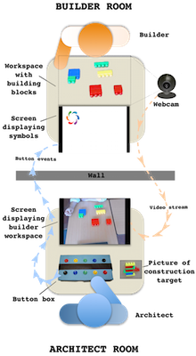
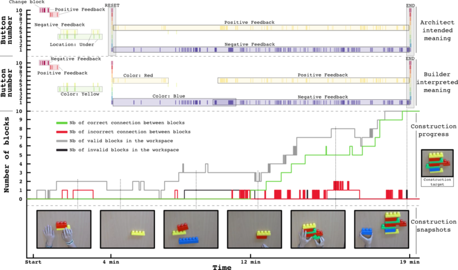

### Studying the Co-Construction of Interaction Protocols in Collaborative Tasks with Humans

In interaction, humans align and effortlessly create common ground in communication, allowing efficient collaboration in widely diverse contexts. Robots are still far away from being able to adapt in such a flexible manner with non-expert humans to complete collaborative tasks. Challenges include the capability to understand unknown feedback or guidance signals, to make sense of what they refer to depending on their timing and context, and to agree on how to organize the interaction into roles and turns.

As a first step in approaching this issue, we investigate the processes used by humans to negotiate a protocol of interaction when they do not already share one.

---

### Video Overview

---

### Explanation of the Project and Results

We introduced a new experimental setup, where two humans have to collaborate to solve a task. Below is a schematic view of our experimental setup. An architect (bottom) and a builder (top) should collaborate in order to build the construction target while located in different rooms. The architect has a picture of the targeted construction, while the builder has access to the construction blocks.

The architect only sees a top view of the builder’s workspace and can communicate with the builder only through the use of 10 buttons which, when pressed, display symbols on a screen on the builder's side. The channels of communication they can use are constrained and force them to invent and agree on a shared interaction protocol in order to solve the task.

These constraints allow us to analyze how a communication protocol is progressively established through the interplay and history of individual actions. We report preliminary results obtained from a pilot study, and discuss how the understanding of strategies used by humans could be useful to achieve more flexible Human-Robot Interaction (HRI).

---

### Timeline of Data Collection

Above is a timeline for one experiment of an architect and a builder collaborating towards building the construction target (right-hand side). The top and middle parts show the timeline of button presses associated with the intended meaning from the architect (top) and the understood meaning from the builder (middle). There were 10 buttons, for which we logged all button presses for each experiment and here display all occurrences as colored dashes. Using the signal meanings participants reported during the game, the events are annotated with the meaning the architect intended or the builder understood.

In this particular example, the builder and the architect successfully agreed on a communication protocol, despite a difficult start requiring a strong visual reset after about 4 minutes. After 19 minutes, the builder built the architect's desired object successfully.

Below is a video example of what such an interaction would look like in a face-to-face scenario:

---

### Participants

Data collected with Chloé Rozenbaum during an internship in the Flowers lab at INRIA.  
Paper with Anna-Lisa Vollmer, Manuel Lopes, Katharina Rohlfing, Pierre-Yves Oudeyer.

---

### Resources

1. **Studying the Co-Construction of Interaction Protocols in Collaborative Tasks with Humans.**  
   Vollmer, A.-L., Grizou, J., Lopes, M., Rohlfing, K., & Oudeyer, P.-Y. (2014).  
   _The Fourth Joint IEEE International Conference on Development and Learning and on Epigenetic Robotics._  
   [PDF](https://hal.archives-ouvertes.fr/hal-01090934/file/avollmer_ICDL2014.pdf)  
   [Slides](https://github.com/jgrizou/coco_game/releases)  
   [GitHub](https://github.com/jgrizou/coco_game)
