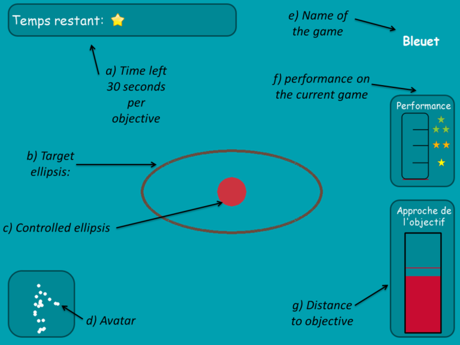

# Experimental Study of Mechanisms of Spontaneous Exploration and Curiosity in Humans

Curiosity is a key element of human development, driving us to explore spontaneously novel objects, activities, and environments. Curiosity-driven exploration strategies permit us to interact, learn, and evolve quickly in an open-ended world.

We designed a game to analyze and measure properties of curiosity-driven exploration of a priori unknown sensorimotor spaces guided by intrinsic motivation. More specifically, we are interested in the relation between exploration and learning progress.

The setup consists of a Kinect tracking the motion of a human. A shape on the screen changes as the human moves, but the mapping between the human’s movements and shape changes is unknown to the human. The human must explore the space of movements to learn how to produce arbitrary shapes proposed on the screen.

### Game Description

There were four games, each displaying a different shape and using a different position-to-shape mapping. The human can select the game they want to play and change as many times as they wish. 

In each game, the subject’s goal is to match the randomly generated shape displayed on the screen. When reached, i.e., when the controlled shape is maintained close enough to the target for one second, a new goal is automatically generated. Objectives change every 30 seconds when not reached. Additional performance indicators were displayed to the subjects to improve intrinsic motivation, implication, and comprehension.

*Game visual interface*

Each of the four games, while visually similar, differs by the difficulty of the underlying mapping (more or less easy to learn). Typically, for each of these mappings, the axes of the ellipsis are controlled by one of the body joints: e.g., the major axis will be controlled by the pitch angle of the left shoulder while the minor axis will be controlled by the yaw angle of the right elbow.

---

## Participants

Data collected with Julie Goliot and Brice Miard during an internship in the Flowers lab at INRIA.  
Paper with Brice Miard, Pierre Rouanet, Pierre-Yves Oudeyer.

---

## Resources

1. **A new experimental setup to study the structure of curiosity-driven exploration in humans.**  
   Miard, B., Rouanet, P., Grizou, J., & Oudeyer, P.-Y. (2014).  
   *Development and Learning and Epigenetic Robotics (ICDL-Epirob), 2014 Joint IEEE International Conferences on.*  
   [PDF](https://github.com/jgrizou/publications/tree/master/poster/conference/2014_icdl_miard)
