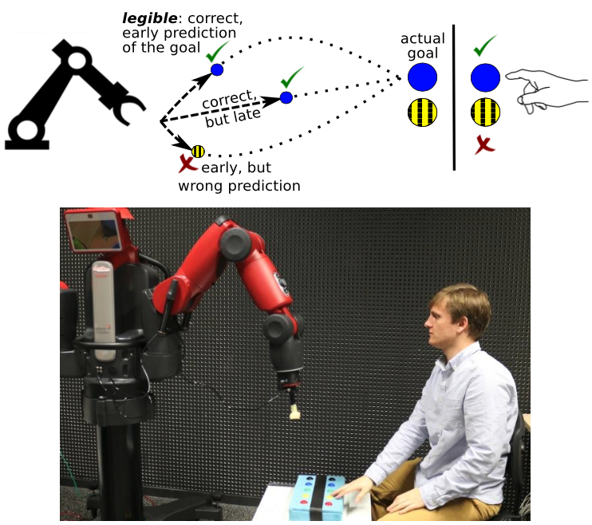

### Facilitating Intention Prediction for Humans by Optimizing Robot Motions

Members of a team are able to coordinate their actions by anticipating the intentions of others. Achieving such implicit coordination between humans and robots requires humans to be able to quickly and robustly predict the robot’s intentions, i.e., the robot should demonstrate behavior that is legible.

Whereas previous work has sought to explicitly optimize the legibility of behavior, we investigate legibility as a property that arises automatically from general requirements on the efficiency and robustness of joint human-robot task completion.

We did so by optimizing fast and successful completion of joint human-robot tasks through policy improvement with stochastic optimization. Two experiments with human subjects show that robots are able to adapt their behavior so that humans become better at predicting sooner the robot’s intentions, which leads to faster and more robust overall task completion.

_Illustration of the robotic setup using Baxter_

Our experiment consists of a robot reaching for and pressing a button. The human subject predicts which button the robot will push, and is instructed to quickly press a button of the same color when sufficiently confident about this prediction. By rewarding the robot for fast and successful joint completion of the task – which indirectly rewards how quickly the human recognizes the robot’s intention and thus how quickly the human can start the complementary action – the robot learns to perform more legible motion. The three example trajectories above illustrate the concept of legible behavior: it enables correct prediction of the intention early on in the trajectory.

### Participants

This work was driven by Baptiste Busch and was the main topic of his PhD thesis.

Papers with Baptiste Busch, Manuel Lopes, Freek Stulp.

### Resources

1. **Learning Legible Motion from Human–Robot Interactions.**  
   Busch, B., Grizou, J., Lopes, M., & Stulp, F. (2017). _International Journal of Social Robotics, 1–15._  
   [Read PDF](https://hal.archives-ouvertes.fr/hal-01629451/file/main_final.pdf)

2. **Facilitating Intention Prediction for Humans by Optimizing Robot Motions.**  
   Stulp, F., Grizou, J., Busch, B., & Lopes, M. (2015). _International Conference on Intelligent Robots and Systems (IROS)._  
   [Read PDF](https://hal.archives-ouvertes.fr/hal-01170977/file/iros2015.pdf)
