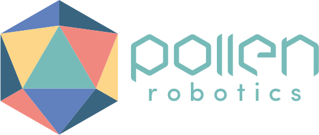

### Open source robotics
_Last update: January 2019_

*Robots are coming! Or so they say. I have been interested in robotics for as long as I can remember. Over the years, I struggled my way through the understanding of all technical parts of robot building. And once I became an expert, I grew frustrated by how unnecessarily painful it was to put a robot together. With some friends and colleagues, we have decided to take our part into making robotics more accessible. Below are our attempts, from an open source robotics community of makers, artists, educators, and scientists, to accessible tools for chemists, we even created a start-up.*

<figcaption>The first Poppy ErgoJr robot jumping.</figcaption>

<figcaption>Open source laboratory robot I developed.</figcaption>

---

### Content
- [Approach](#approach)
- [Team](#team)
- [Projects](#projects)
  - [Poppy Project – Open source robots for art, science, and education](#poppy-project)
  - [Laboratory Robotics – Tools for open research in chemistry labs](https://jgrizou.com/projects/open-robotics/#laboratory-robotics)
  - [Startup – Pollen Robotics & Luos](#start-up)
  - [Personal Projects](#personal-projects)
- [Resources](#additional-resources)

---

### Approach
In all projects presented below, we strived to develop empowering tools, both software and hardware, that reduce the complexity required for developing robotic devices. But we did not stop there.

We relentlessly worked to make these tools accessible to all. Our creations are available online for free and with documentation. We also provided demonstrations of our technology in various application domains, from art to science, with one of our projects seeing significant development in school education in France.

On a personal level, I have learned that technology alone can’t make an impact. It needs to be embedded into meaningful products that make what was previously impossible possible, or inaccessible accessible, in our everyday lives.

---

### Team
The [Poppy Project](https://jgrizou.github.io/website/projects/open_robotics/#poppy-project) was initiated by Matthieu Lapeyre, Pierre Rouanet, and Pierre-Yves Oudeyer while at INRIA. Didier Roy joined and developed the Poppy Education project, which was introduced to many schools in France. I was part of the founding team and was very active during the period 2012–2016.

The [laboratory robotics work](https://jgrizou.github.io/website/projects/open_robotics/#laboratory-robotics) was developed while I worked as a research associate and team leader in a chemistry lab (2015–2017). See the [associated project page](https://jgrizou.github.io/website/projects/chemobot) for more info.

The start-up [Pollen Robotics](https://jgrizou.github.io/website/projects/open_robotics/#start-up) was co-founded by Matthieu Lapeyre, Pierre Rouanet, Nicolas Rabault, and myself. I acted as COO and departed for new adventures in 2018.

---

### Projects

#### Poppy Project

##### History
The [Poppy Project](https://www.poppy-project.org/en/) was born in 2012 in the Flowers Laboratory at INRIA Bordeaux Sud-Ouest. It was initiated during Matthieu Lapeyre’s PhD Thesis supervised by Pierre-Yves Oudeyer. At the beginning, the development team included Matthieu Lapeyre (mechanics & design), Pierre Rouanet (software), and myself (electronics).

<figcaption>Matthieu Lapeyre with the first version of Poppy Humanoid.</figcaption>

The project grew into an international open-source initiative and gathered a [community](https://forum.poppy-project.org/) of makers, artists, educators, and scientists.

<figcaption>Left: A Poppy Humanoid kit. Middle: Poppy Torso and Poppy ErgoJr. Right: Poppy ErgoJr.</figcaption>

Our robots were later used in a national education program to teach robotics and programming in schools. Didier Roy and Pierre-Yves Oudeyer led this effort, forming the [Poppy Education](https://www.poppy-education.org/) project at INRIA. This effort gained national recognition, resulting in the creation of an independent educator association, [Poppy Station](https://www.poppystation.org/).

*Fun fact:* Our Humanoid robot met François Hollande, the President of France.

##### Flagship Projects
1. **Poppy Humanoid**
   - An open-source and 3D-printed humanoid robot designed by Matthieu Lapeyre.
   - Optimized for research and education purposes.
   - Code, 3D designs, and documentation are available on GitHub ([>280 stars](https://github.com/poppy-project/poppy-humanoid)).

   

   

2. **Pypot**
   - A Python library for controlling Dynamixel motors.
   - Designed by Pierre Rouanet.
   - Code and documentation are available on GitHub ([>170 stars](https://github.com/poppy-project/pypot)).

3. **Poppy ErgoJr**
   - A small and low-cost 6-degree-of-freedom robot arm.
   - Designed for easy 3D printing and assembly.
   - Code, 3D designs, and documentation are available on GitHub ([>75 stars](https://github.com/poppy-project/poppy-ergo-jr)).

<figcaption>The first Poppy ErgoJr robot jumping.</figcaption>

<figcaption>ErgoJr robot with different tool endings.</figcaption>

The ErgoJr robot is the primary robot used by [Poppy Education](https://www.poppy-education.org/), serving thousands of students.

---

#### Websites:
- [Poppy Project](https://www.poppy-project.org/en/)
- [Poppy Education](https://www.poppy-education.org/)
- [Poppy Station](https://www.poppystation.org/)

### Personal Contributions

Between 2012 and 2016, as part of the founding team, I had an active role in the development of the project. I was especially active on the [forum](https://forum.poppy-project.org/) to develop the community. I built, and contributed to, several tools and robots.

#### First ErgoJr  
I built the [first version](https://twitter.com/jgrizou/status/563646210058502145) of the ErgoJr robot. In the quest of modular robot design, I developed a set of OpenScad libraries to develop parametric robotic parts using code. Full details on the [dedicated project page](https://jgrizou.github.io/website/projects/parametric_parts).

  
*The first Poppy ErgoJr robot jumping.*

  
*Robots designed by code.*

#### ErgoJr in the Browser  
Using [three.js](https://threejs.org/), I developed an ErgoJr model that can be interacted with directly in the browser. This enables students to play and test code on the robot without having access to a physical robot. Thanks to Pierre Rouanet, the web simulator can be controlled with exactly the same code library as the physical robot.

<iframe class="elementor-video" frameborder="0" allowfullscreen="" src="https://www.youtube.com/embed/Hl0-hBIGIPw"></iframe>  
*Demonstration of the control of ErgoJr in the browser via Python.*

<iframe class="elementor-video" frameborder="0" allowfullscreen="" src="https://www.youtube.com/embed/T9FwFOBoz7Y"></iframe>  
*Pierre Rouanet demonstrates the link between the physical and the simulated robot.*

For more information:  
- [Demo](http://simu.poppy-project.org/poppy-ergo-jr/)  
- [Getting Started](https://docs.poppy-project.org/en/getting-started/visualize.html#using-our-web-visualizer)  
- [Website](http://simu.poppy-project.org/)  
- [Forum Thread](https://forum.poppy-project.org/t/ergojr-in-the-browser/1609)

#### Soft Robots  
I developed a method to integrate flexible silicon parts that can be easily designed and built at a very low cost (>1$). I designed a soft starfish robot as a proof of principle.

  
*A robot with flexible parts.*

For more information:  
- [Github soft starfish](https://github.com/poppy-project/poppy-soft-starfish)  
- [Github soft connector](https://github.com/poppy-project/poppy-soft-connector)  
- [Forum Thread](https://forum.poppy-project.org/t/poppy-soft-connector/2152)

### Laboratory Robotics

Between 2015 and 2018, I led a team of interdisciplinary researchers in a Chemistry lab on the [digitization of Chemistry](https://jgrizou.github.io/website/projects/chemobot). As a trained roboticist, I developed tools to help less experienced programmers build automated laboratory devices and robots. Below are some tools I developed, with more available on the [Cronin group Github page](https://github.com/croningp).

#### Commanduino – Arduino Control in Python  
The [Commanduino](https://github.com/croningp/commanduino) library is a Python library used to communicate with Arduino devices via Python, as opposed to hardcoding behavior onto the Arduino itself.

I introduced modularity in the design of Arduino-based robots. To add a new device (motor, servo, sensor), one needs to add a few lines of code on the Arduino board. This device then becomes controllable via Python on a connected computer. The following diagram shows the architecture of Commanduino, highlighting its communication layers.

  
*Architecture of the Commanduino layers of communication.*

With Commanduino, an Arduino main file becomes simple to write, focusing only on the device you want to control. For example, registering a servo on pin 9:

  
*Code on the Arduino side.*

You can then plug the board into a computer and use the following code to control and read from the servo:

  
*Code on the Python side.*
- [Poppy Forum](https://forum.poppy-project.org/)
- [GitHub](https://github.com/poppy-project)

Commanduino makes quick iterative development possible using Arduino and Python, even for beginners. It is particularly useful when designing new robots without well-defined specifications, as it requires adapting on the fly to the problems you encounter.

However, that amount of user-side readability on Arduino code required a fairly complex code architecture, and adding new devices is a job for advanced programmers.

**Libraries:**  
[Commanduino](https://github.com/croningp/commanduino)  
[Arduino CommandTools](https://github.com/croningp/Arduino-CommandTools)  
[Arduino CommandHandler](https://github.com/croningp/Arduino-CommandHandler)  
[Graham Keenan](https://github.com/ShinRa26) wrote the documentation and coded additional devices.

---

## Pump Control

I developed `pycont`, a Python library to control Tricontinent C3000 pumps. It is meant to be easy to use and transparent so that when reading your program, you can actually know what is going on.  
[Graham Keenan](https://github.com/ShinRa26) wrote the documentation. More details on [GitHub](https://github.com/croningp/pycont).

---

## Modular Syringe Driver

I designed a small linear actuator with interchangeable tools that is very handy for developing custom laboratory robots. The appeal of this device is its modularity, as many different additions can be designed and printed.  
[Graham Keenan](https://github.com/ShinRa26) wrote the documentation. More details on [GitHub](https://github.com/croningp/ModularSyringeDriver) and [OnShape](https://cad.onshape.com/documents/56ab4447e4b0dff6d869c7ac/w/10403a3c4431f66501924e81/e/ad868b310df8ef7bb56f2516).

  
*3D design of the modular actuator with interchangeable tools.*

  
*A modular syringe fully assembled.*

---

## Droplet Tracking

A collection of software tools to handle various video-related tasks, including recording a video, setting webcam parameters, and tracking moving droplets in a petri dish. More details on [GitHub](https://github.com/croningp/chemobot_tools).

---

## Dropfactory Robot

The [Dropfactory robot](https://github.com/croningp/dropfactory) is a great example of what can be made when combining the above tools. The design and code are entirely open source, see [GitHub](https://github.com/croningp/dropfactory).

  
*Open source laboratory robot I developed.*

I developed this robot to undertake [research on the efficiency of curious algorithms on the exploration of chemical systems](https://jgrizou.github.io/website/projects/chemobot#dropfactory). Dropfactory can perform 300 droplet experiments a day in full autonomy (each experiment requires recording of 1m30s). Compared to previous robots, this is a 6-fold improvement and a major leap in reliability. This robot performed more than 20k droplet experiments while I worked in the Cronin group and routinely functioned for 12 hours per day.

---

# Startup – Pollen Robotics and Luos

Together with Matthieu Lapeyre, Pierre Rouanet, and Nicolas Rabault, we co-founded [Pollen Robotics](http://pollen-robotics.com/).

  
*The co-founders. From left to right: Pierre Rouanet, Jonathan Grizou, Nicolas Rabault, Matthieu Lapeyre.*

Our objective was to make robotics more accessible by commercializing our tools for the quick creation of robots, specifically a technology for modular robotics comprising a communication bus called Robus. Below was our attempt to explain that technology.

  
*Luos pitch to YC Startup School.*

  
*Luos technology principle and example.*

While at Pollen Robotics, we developed a variety of robots to showcase the technology’s versatility. Among them were a human-sized robotic arm and a small dynamic quadruped robot.

  
*Reachy – Human size robotic arm.*

  
*Doggy – Robotic gaming platform.*

The team also designed a very cheap (< $2 in parts) educational robot in collaboration with the [Nathan](https://editions.nathan.fr/) French publishing house. The resulting product is called [Robot Labo](http://robotlabo.nathan.fr/) and was commercialized in physical shops all over France for Christmas 2018.

  
*Promotional video of Robot Labo.*

  
*Packaging of Robot Labo.*

I voluntarily departed from Pollen Robotics in 2018 following a pivot. This pivot led to a split in the activities and the creation of a second startup, [Luos Robotics](https://www.luos.io). At the time of this writing, [Pollen Robotics](https://www.pollen-robotics.com/) is a robotic design studio that starts from an idea to develop a functioning product, while [Luos Robotics](https://www.luos.io/) aims to commercialize the Robus modular technology. We were awarded a [European SME Instrument H2020 grant](https://ec.europa.eu/programmes/horizon2020/en/h2020-section/sme-instrument) for this project.

  
*Logo of Pollen Robotics.*

  
*Logo of Luos Robotics.*

---

# Personal Projects

Personal projects are listed on the project page, under the ["Stuff I built"](https://jgrizou.com/website/projects/#stuff) section.

---
