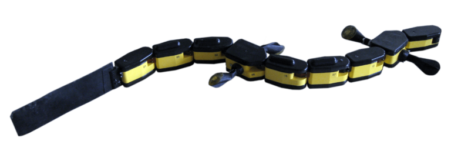
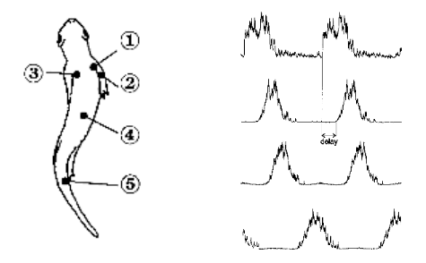
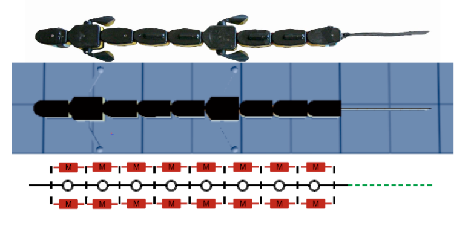
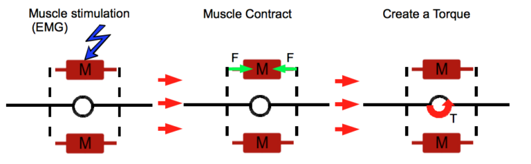

# Modeling the Salamander Swimming Gait with Virtual Muscles on a Robotic Platform

**Note:** See the project as of 2011 on the BioRob website: [https://biorob.epfl.ch/grizou](https://biorob.epfl.ch/grizou). For memory's sake, I have kept the same structure and text as my original 2011 version and simply added relevant videos within the text.

*The salamander robot used in this work.*

## Abstract

This project intends to model the interaction between muscle activation and body curvature for salamander locomotion. The final objective is to reproduce a swimming dynamic on the salamander robot, a nine-segment bio-inspired robot capable of swimming and walking, by driving the resulting musculoskeletal model with recorded electromyography.

At first, kinematics of several salamanders were extracted from slow-motion X-ray movies. Afterwards, the musculoskeletal model architecture was developed based on previous works and robot constraints. Using the Webots simulator, the model parameters were optimized according to statistical electromyography and kinematics. Finally, the model was successfully tested on the salamander robot in the lab.

## Summary

**Why:**  
The BIOROB laboratory is well known for its work on central pattern generators (CPG), which are neuronal circuits in charge of animal locomotion. Unfortunately, the link between neural activity and body dynamics is not yet modeled for the salamander robot, making it impossible to control based on a realistic neuronal CPG. This project aims to make a new step in this direction to study CPG networks in real interaction conditions and explore how feedback information could be integrated into this network.

**What:**  
Trying to obtain a realistic swimming gait with a realistic pattern in muscle activation.

**How:**  
Optimization process on the morphological model (muscle/joint model).

**Needs:**  
- Realistic data for muscle activation  
- Realistic data for the swimming gait  

**Tools:**  
- Webots robotic simulation software  
- Salamander robot  

## Overview

Realistic data for muscle activations (EMG) were extracted from:  
I. Delvolvé, T. Bem, and J.M. Cabelguen. *Epaxial and limb muscle activity during swimming and terrestrial stepping in the adult newt, Pleurodeles waltl.* Journal of Neurophysiology, 78(2): 638, 1997.

<iframe width="640" height="360" src="https://www.youtube.com/embed/t6hQE4Kf4iQ?controls=1&rel=0" frameborder="0" allowfullscreen></iframe>  
*Real Salamander Swimming.*

<iframe width="640" height="360" src="https://www.youtube.com/embed/5iywdtXVkq0?controls=1&rel=0" frameborder="0" allowfullscreen></iframe>  
*X-Ray of a swimming salamander.*

Muscles' properties and muscle-to-body interaction are simulated based on the current body position and the muscle activation level.

The resulting parameters are joint torques that can be applied to the robotic platform or simulated robot. Depending on the interaction condition, a new body position is defined, and the process is repeated.

The optimization process helps find the best set of morphological parameters to reproduce a realistic swimming gait based on a realistic pattern in muscle activation.

<iframe width="640" height="360" src="https://www.youtube.com/embed/Vw7jM3cd5Hs?controls=1&rel=0" frameborder="0" allowfullscreen></iframe>  
*Optimization Result in Webots.*

<iframe width="640" height="360" src="https://www.youtube.com/embed/0LADFUyRaHU?controls=1&rel=0" frameborder="0" allowfullscreen></iframe>  
*Optimization Result in Matlab Processing.*

Once a reasonable set of parameters is found, the morphological model is implemented on the robotic platform. This part is challenging because it involves real-time interaction, torque control, and hardware limitations (e.g., maximal torque limit). Switching to the real world allows for sensing the robot's dynamics—muscles give passive properties to the robot that are hard to feel in simulation.

<iframe width="640" height="360" src="https://www.youtube.com/embed/KU0XrAa6Gws?controls=1&rel=0" frameborder="0" allowfullscreen></iframe>  
*Lamprey Passive Properties.*

<iframe width="640" height="360" src="https://www.youtube.com/embed/uGtc3DciIhg?controls=1&rel=0" frameborder="0" allowfullscreen></iframe>  
*Salamander Passive Properties.*

Below are two additional videos of the robot swimming in water using the simulated muscle model:

<iframe width="640" height="360" src="https://www.youtube.com/embed/wM-HoDmEPBA?controls=1&rel=0" frameborder="0" allowfullscreen></iframe>  
*Salamander Swim 0.5Hz.*

<iframe width="640" height="360" src="https://www.youtube.com/embed/zasxxgAcjLM?controls=1&rel=0" frameborder="0" allowfullscreen></iframe>  
*Salamander Turns 0.5Hz.*

## Resources

The thesis, reports, and presentations are available at [https://github.com/jgrizou/publications/tree/master/thesis/master](https://github.com/jgrizou/publications/tree/master/thesis/master).
