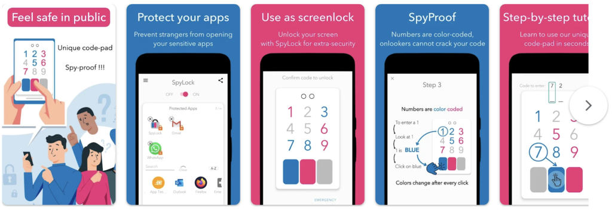

# Spylock

Spylock used a shoulder-surfing proof pin-entry method to help users lock apps on their smartphones. I learned Kotlin and the entire Android development suite, including billing. I also learned a lot about UX/UI design via this project.

Spylock might still be on the Play Store:  
[https://play.google.com/store/apps/details?id=com.grizai.android.spylock](https://play.google.com/store/apps/details?id=com.grizai.android.spylock)

---

---

## Spylock Tour with Voice Over

<iframe title="Spylock Tour with Voice Over" width="500" height="281" src="https://www.youtube.com/embed/KlBMiKzMG-o?feature=oembed" frameborder="0" allow="accelerometer; autoplay; clipboard-write; encrypted-media; gyroscope; picture-in-picture; web-share" allowfullscreen></iframe>

---

## Spylock Teaser

Spylock teaser:  
[https://youtu.be/PuxXKq_5pF4](https://youtu.be/PuxXKq_5pF4)

---

## Spylock PlayStore

<iframe title="Spylock PlayStore" width="500" height="281" src="https://www.youtube.com/embed/tLt7Uhnc1DA?feature=oembed" frameborder="0" allow="accelerometer; autoplay; clipboard-write; encrypted-media; gyroscope; picture-in-picture; web-share" allowfullscreen></iframe>

Ad I used on social media at the time:  
[https://youtube.com/shorts/rvN4rPsGNPQ](https://youtube.com/shorts/rvN4rPsGNPQ)

---

## Lessons Learned

I killed SpyLock after 5 months (including learning and development) because the bulk of the user traction came from teenagers who do not have the desire to pay for this kind of service. I was not interested in an advertising-based funding model.
