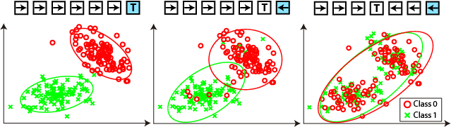
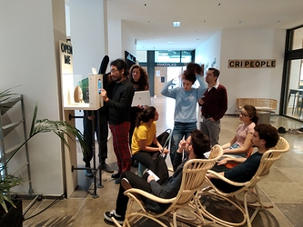
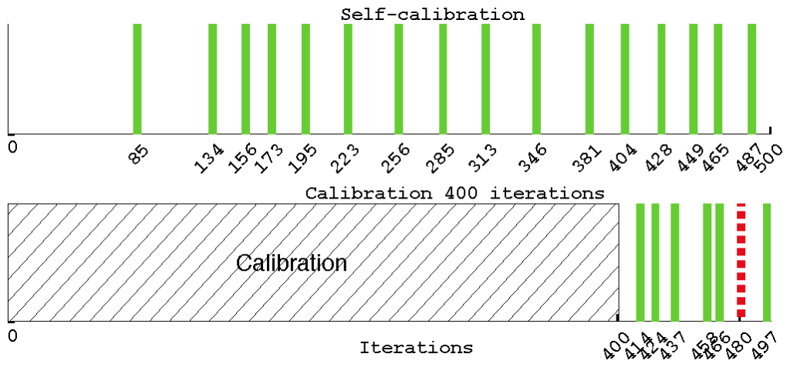
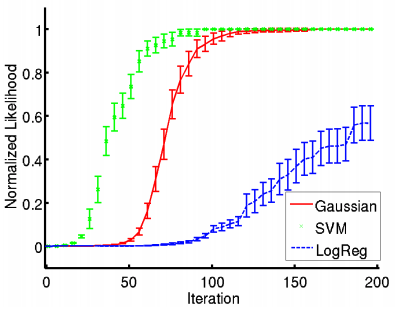
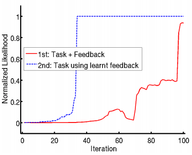
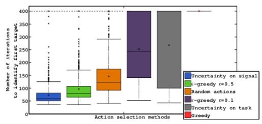

# An intriguing AI paradigm: interactive learning from unlabeled instructions
*Last update: January 2019*

*Providing you neither know the game of chess nor the French language, could you learn the rules of chess from a person speaking French? In machine learning, this problem is usually avoided by freezing one of the unknowns (e.g. chess or french) during a calibration phase. During my PhD, I tackled the full problem and proposed an innovative solution based on a measure of consistency of the interaction. We applied our method to human-robot and brain-computer interaction and studied how humans solve this problem. This work was awarded a PhD price handed by Cédric Villani (2010 Fields Medal).*

---

### Content

### Approach
*Can an agent learn a task from human instruction signals without knowing the meaning of the communicative signals? Can we learn from unlabeled instructions?* [1](https://jgrizou.com/projects/thesis/#fn1)

The problem resembles a chicken-and-egg scenario: to learn the task you need to know the meaning of the instructions (interactive learning), and to learn the meaning of the instructions you need to know the task (supervised learning).

However, a common assumption is made when tackling each of the above problems independently: the user providing the instructions or labels is acting consistently with respect to the task and to its own signal-to-meaning mapping. In short, the user is not acting randomly but is trying to guide the machine towards one goal and using the same signal to mean the same things. The user is consistent.

---

Hence, by measuring the consistency of the user signal-to-meaning mapping with respect to different tasks, we are able to recover both the task and the signal-to-meaning mapping, solving the chicken-and-egg problem without the need for an explicit calibration phase. And we do so while avoiding the combinatorial explosion that would occur if we tried to generate hypotheses over the joint [task, signal-to-meaning] space, most prevalent when the signals are continuous.

Our contribution is a variety of methods to measure the consistency of an interaction, as well as a planning algorithm based on the uncertainty of that measure. We further proposed methods to scale this work to continuous state domains, infinite numbers of tasks, and multiple interaction frame hypotheses. We further applied these methods to a human-robot learning task using speech as the modality of interaction and to brain-computer interfaces with real subjects.

I am currently working on a simple and visual explanation of this research. In the meantime, please refer to the videos and documents in the [additional resources section](https://jgrizou.github.io/website/projects/thesis/#additional-resources).

---

### Team
PhD advisors: [Manuel Lopes](https://scholar.google.com/citations?user=kqkq_coAAAAJ&hl=fr&oi=ao) and [Pierre-Yves Oudeyer](http://www.pyoudeyer.com/).

BCI collaborators: [Iñaki Itturate](http://people.epfl.ch/inaki.iturrate) and [Luis Montesano](http://webdiis.unizar.es/~montesan/web/).

---

### Projects

### Online Demo
I am currently designing a web application to demonstrate the concept of self-calibrating interfaces. A preliminary version of the challenge is available online as a puzzle game: [Open Vault Challenge](http://discourse.cri-paris.org/t/introduction-to-the-open-vault-challenge/201) and more details are available here: [arxiv paper](https://arxiv.org/pdf/1906.02485.pdf).

The demo takes the form of a challenge to open a vault. The vault is secured by a 4-digit code that can be typed via a simple user interface on a screen. You have access to videos of a user entering the code into the interface and can watch it as much as required. The challenge is to crack the code, open the vault, and collect its content.

---

There are 5 levels of increasing complexity, and from level 3 onward the interface is built using the calibration-free interface paradigms presented on this page, making it difficult for an observer to infer what the user is typing as the meaning associated with each button/action is decided on the fly by the human.

#### Resources
1. **The Open Vault Challenge–Learning how to build calibration-free interactive systems by cracking the code of a vault.** Grizou, Jonathan (2019). *International Joint Conferences on Artificial Intelligence.* [pdf](https://arxiv.org/pdf/1906.02485.pdf) [project](https://jgrizou.github.io/website/projects/thesis)

---

### Application to Brain-Computer Interfaces
In brain-computer interfaces (BCI), an explicit calibration phase is typically required to build a decoder that translates raw electroencephalography (EEG) signals from the brain of a user into meaningful instructions. By applying our method to BCI, we remove the need for a calibration phase.

The experimental setup is shown below. The user has to guide an agent towards a specific location of its choosing on the grid. The user informs the agent by thinking yes or no after each movement. The user’s brain activity is recorded and used as our unlabeled feedback signal. Similar setups are used to help persons with handicaps to spell.

---

A calibration procedure would run for a fixed period of interaction, say 400 movements of the green dot, before the user can actually start controlling the device. With our method, the system is able to estimate when sufficient evidence has been accumulated and can solve a first task after only 85 iterations in the example below case.

---

The method has been evaluated in closed-loop online experiments with 8 users. The results show that it is possible to have a usable BCI control from the beginning of the experiment without any prior calibration. Furthermore, comparisons with simulations and previous results obtained using standard calibration hint that both the quality of recorded signals and the performance of the system were comparable to those obtained with a standard calibration approach.

#### Resources
1. **Exploiting task constraints for self-calibrated brain-machine interface control using error-related potentials.** Iturrate, I., Grizou, J., Omedes, J., Oudeyer, P., Lopes, M., et al. (2015). *PloS one.* [pdf](http://journals.plos.org/plosone/article?id=10.1371/journal.pone.0131491) [github](https://github.com/flowersteam/self_calibration_BCI_plosOne_2015)
2. **Calibration-Free BCI Based Control.** Grizou, J., Iturrate, I., Montesano, L., Oudeyer, P.-Y., & Lopes, M. (2014). *International AAAI Conference on Artificial Intelligence.* [pdf](https://hal.archives-ouvertes.fr/hal-00984068/PDF/grizou2014calibration.pdf) [poster](https://github.com/jgrizou/publications/tree/master/paper/conference/2014_aaai)
3. **Interactive Learning from Unlabeled Instructions.** Grizou, J., Iturrate, I., Montesano, L., Oudeyer, P.-Y., & Lopes, M. (2014). *Conference on Uncertainty in Artificial Intelligence (UAI).* [pdf](https://hal.archives-ouvertes.fr/hal-01007689/PDF/grizou2014interactive.pdf) [poster](https://github.com/jgrizou/publications/tree/master/paper/conference/2014_uai)

---

### Application to Human-Robot Interaction
Our first demonstration of this work involved a pick-and-place robot that had to identify the cube configuration the user had in mind. The user provided feedback instructions (correct/incorrect) with their voice. Thanks to our approach, the user could use any word desired to mean correct or incorrect, e.g., ‘dog’ for *correct* and ‘cat’ for *incorrect*, which worked as well as ‘yes’ and ‘no’.

---

Example of interaction. The robot performs an action and I provide feedback on the action according to its optimality towards building a specific cube configuration I have in mind. I use my voice to provide the feedback, and the robot does not know initially which sounds I use to mean correct or incorrect. Not my best video 🙂

We evaluated the performance of our algorithm in simulation using pre-recorded spoken words and a model of the robotic task. We showed that it is possible to learn the meaning of unknown and noisy teaching instructions, as well as a new task at the same time. And that the performance can vary depending on the classifier we use to measure consistency or the planning heuristic we use to select the agent action.

Each plot shows the computed probability of the correct task per number of human-robot interaction. Left: Study of different classifiers. Right: Study of different planning heuristics.

We then showed that once a first task has been identified, it is possible to reuse the acquired knowledge about instructions for learning new tasks much faster. Indeed, once a first task is identified, we can revisit the history of interactions and assign the true label to each signal, enabling us to build a signal decoder and removing one side of our problem.

*Once a first task is learned using our method, the second task is much faster to learn as we can train an explicit signal-to-meaning classifier.*

### Resources
1. **Robot learning simultaneously a task and how to interpret human instructions.** Grizou, J., Lopes, M., & Oudeyer, P.-Y. (2013). *Development and Learning and Epigenetic Robotics (ICDL), 2013 IEEE Third Joint International Conference on.* **Student Travels Award.** [pdf](https://hal.archives-ouvertes.fr/hal-00850703/document) [slides](https://github.com/jgrizou/publications/tree/master/paper/conference/2013_icdl)

In later studies, we developed a new uncertainty measure taking into account the uncertainty on the task space and the signal space. This metric can be used to select the next actions of our agent in order to solve the problem faster. This measure is non-intuitive as it is a mix of trying to disambiguate the possible tasks, while trying to disambiguate the possible signal-to-meaning mappings, both often requiring opposite actions. By explicitly measuring the joint uncertainty, our agents were able to reduce considerably the time to identify a first task. Planning was key for the success of our BCI application.

*Number of iterations to identify a first task from unlabeled instructions. The planning method has a significant impact on performance. Planning using our uncertainty measure outperformed all other methods. Using only an uncertainty measure based on the tasks performs poorly. A 50% greedy on task / 50% random policy has shown good performance, showing the non-intuitive aspect of the planning problem.*

### Resources
1. **Interactive Learning from Unlabeled Instructions.** Grizou, J., Iturrate, I., Montesano, L., Oudeyer, P.-Y., & Lopes, M. (2014). *Conference on Uncertainty in Artificial Intelligence (UAI).* [pdf](https://hal.archives-ouvertes.fr/hal-01007689/PDF/grizou2014interactive.pdf) [poster](https://github.com/jgrizou/publications/tree/master/paper/conference/2014_uai)

### Can humans solve this problem?
Inspired by the above results, we devised an experimental setup to investigate the processes used by humans to negotiate a protocol of interaction when they do not already share one. More information on the [dedicated project page](https://jgrizou.github.io/website/projects/coco_game).

## Awards
I received the [Prix Le Monde de la Recherche Universitaire 2015](https://www.lemonde.fr/kiosque/recherche/laureats/prix-recherche-laureats-2015.html) for this work. Each year, this prize is awarded to 5 young French scientists across all fields of ‘hard’ science. [Cédric Villani](https://en.wikipedia.org/wiki/C%C3%A9dric_Villani) (2010 Fields Medal) chaired the jury. We [co-authored](https://www.amazon.fr/Cedric-Villani-pr%C3%A9sente-laur%C3%A9ats-monde/dp/2746510944/) a book featuring the work of each laureate. More: [Application letter](https://jgrizou.github.io/website/projects/thesis/media/candidature_prix_le_monde.pdf) [INRIA article](http://www.inria.fr/centre/bordeaux/actualites/j.-grizou-laureat-du-prix-le-monde-de-la-recherche-universitaire) [HuffPost article](http://www.huffingtonpost.fr/2016/02/08/ordinateur-lire-pensees-ma-these-en-deux-minutes_n_9168306.html)

I received the [student travel award](http://www.er.ams.eng.osaka-u.ac.jp/icdl-epirob-2013/index.html) for our first paper on the topic titled: *Robot Learning Simultaneously a Task and How to Interpret Human Instructions, ICDL-EpiRob, 2013*.

## Additional Resources
### PhD Defense
[Watch the video here](https://www.youtube.com/embed/w62IF3qj8-E?controls=1&rel=0&playsinline=0&modestbranding=0&autoplay=0&enablejsapi=1&origin=https%3A%2F%2Fjgrizou.com&widgetid=3)

Download the [slides](https://github.com/jgrizou/thesis_manuscript/releases/download/final/defense_slides.pdf) and the [manuscript](https://github.com/jgrizou/thesis_manuscript/releases/download/final/thesis.pdf).

### Videos
Tutorial:
- Introduction: [https://youtu.be/rPGYqylud1k](https://youtu.be/rPGYqylud1k)
- How it works: [https://youtu.be/NFKh6V9zgaY](https://youtu.be/NFKh6V9zgaY)
- Planning: [https://youtu.be/1sshBzWM7u8](https://youtu.be/1sshBzWM7u8)

[All related videos](https://www.youtube.com/playlist?list=PLBppiRCztuKohELU34f2LBQ8-8X8R8zo0)

### Publications
1. **The Open Vault Challenge–Learning how to build calibration-free interactive systems by cracking the code of a vault.** Grizou, Jonathan (2019). *International Joint Conferences on Artificial Intelligence.* [pdf](https://arxiv.org/pdf/1906.02485.pdf) [project](https://jgrizou.github.io/website/projects/thesis)
2. **Learning from Unlabeled Interaction Frames.** Grizou, J. (2014). *PhD Thesis.* **PhD Thesis Award.** [pdf](https://github.com/jgrizou/thesis_manuscript/releases/final/) [code](https://github.com/jgrizou/thesis_code) [latex](https://github.com/jgrizou/thesis_manuscript)
3. **Exploiting task constraints for self-calibrated brain-machine interface control using error-related potentials.** Iturrate, I., Grizou, J., Omedes, J., Oudeyer, P., Lopes, M., et al. (2015). *PloS one.* [pdf](http://journals.plos.org/plosone/article?id=10.1371/journal.pone.0131491) [github](https://github.com/flowersteam/self_calibration_BCI_plosOne_2015)
4. **Calibration-Free BCI Based Control.** Grizou, J., Iturrate, I., Montesano, L., Oudeyer, P.-Y., & Lopes, M. (2014). *International AAAI Conference on Artificial Intelligence.* [pdf](https://hal.archives-ouvertes.fr/hal-00984068/PDF/grizou2014calibration.pdf) [poster](https://github.com/jgrizou/publications/tree/master/paper/conference/2014_aaai)
5. **Interactive Learning from Unlabeled Instructions.** Grizou, J., Iturrate, I., Montesano, L., Oudeyer, P.-Y., & Lopes, M. (2014). *Conference on Uncertainty in Artificial Intelligence (UAI).* [pdf](https://hal.archives-ouvertes.fr/hal-01007689/PDF/grizou2014interactive.pdf) [poster](https://github.com/jgrizou/publications/tree/master/paper/conference/2014_uai)
6. **Robot learning simultaneously a task and how to interpret human instructions.** Grizou, J., Lopes, M., & Oudeyer, P.-Y. (2013). *Development and Learning and Epigenetic Robotics (ICDL), 2013 IEEE Third Joint International Conference on.* **Student Travels Award.** [pdf](https://hal.archives-ouvertes.fr/hal-00850703/document) [slides](https://github.com/jgrizou/publications/tree/master/paper/conference/2013_icdl)

## Personal Notes
I am still looking for a real-world application that can be useful to a wider number of people. Any ideas?

## Footnotes
1. Let me explain the title:
   - **Learning** means the agent should be able to perform something new at the end of the day, which should not be programmed by hand in the system.
   - **Interactive learning** means the agent is acting in the world and receiving feedback from its environment.
   - **Interactive learning from instructions** means the agent learns by receiving instructions (e.g., “go left”, “go right”, “it was correct”, “it was incorrect”) in an interactive way. Such instructions are conveyed by a human (or another machine/agent) in the form of a discrete or continuous signal (speech, gesture, brain activity, etc.).
   - **Interactive learning from unlabelled instructions** means the instructions are known to be of a specific type, i.e., there exist hidden labels (e.g., only feedback instruction of type correct/incorrect). However, the agent does not know the mapping between the instruction signals (speech, gesture, brain activity, etc.) and their labels/meanings.
