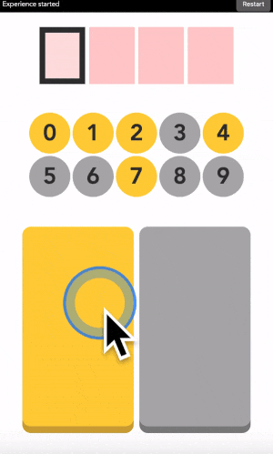
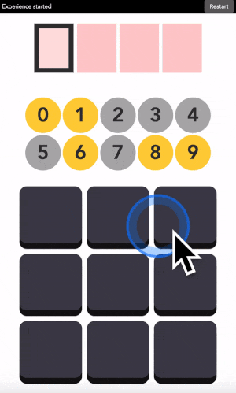
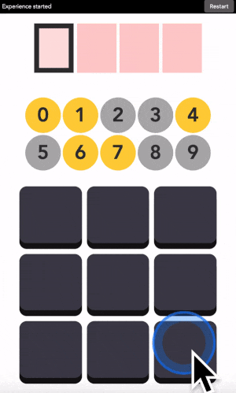
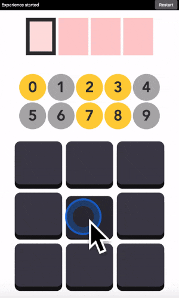
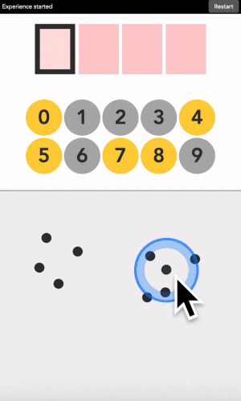
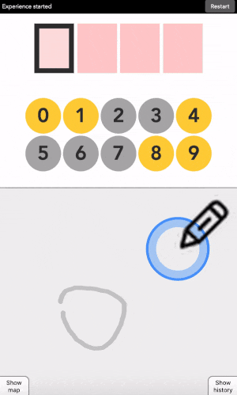
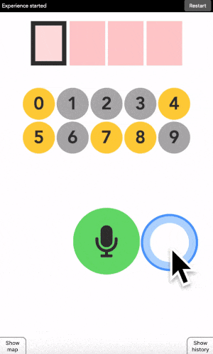
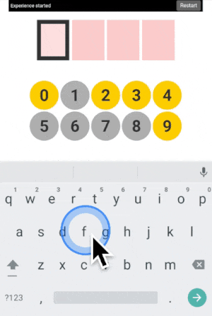

> **UPDATE:** The page below is deprecated and might be hard to understand without prior knowledge, please read [https://arxiv.org/pdf/2212.05766.pdf](https://arxiv.org/pdf/2212.05766.pdf) for now.

### This interface can read your mind

Last update: August 2019  
*A web-app to explain self-calibrating interfaces.*

### Introduction

Below is a typical user interface. It is a code entering device. To enter a code, you look at the digit you want to type, if it is yellow you click on the yellow button. If it is grey, you click on the grey button. And the machine will find out the digit you have in mind by elimination.

With two big colored buttons, this interface is designed to remove most user choices and channel you to behave in one standardized way. The aim is normative, it is more efficient and convenient for the designers if we all behave the same way, and it is also easier to predict your future actions. Think of apps like Instagram or Twitter, designers have done a great job at funneling our interaction there.

But let me show you another way to interact with digital devices.

Below is the same interface but buttons have no predefined colors. You get to decide the buttons’ color in your mind, and the machine adapts to your preferences on the fly.

  
**User 1 choice.**

  
**User 2 choice.**

  
**User 3 choice.**

Notice how, once revealed, the color patterns on buttons are different for each user. This reflects their personal preferences. Each user typed in the same digit but they used the buttons differently to do so. Yet the machine was able to adapt, finding both what the user wanted to do (enter the digit 1) and how it was trying to do it (the colors associated to each button).

I call these *self-calibrating interfaces* because they adapt to your preferences while you are using them.

You will find below several options to play with these interfaces and gain a deeper understanding of how they work.

### Learning tracks

Quick access: [Crack it](crack-it) [Try it](try-it) [Grasp it](grasp-it)

---

### Crack it – the open vault challenge

> When you teach a child something you take away forever his chance of discovering it for himself – Jean Piaget

If you want to really get it, you should reinvent it for yourself. So I have designed a challenge tailored for participants to gain an intuitive understanding of self-calibrating interfaces.

In this challenge, you will see me entering a secret code in various interfaces. Your goal is to crack the code and enter it correctly into the interface. By doing so you are forced to think like the machine.

The challenge is divided into levels of increasing complexity, designed for a progressive learning experience. Clues and take home messages are available if you get stuck.

[Go to challenge](https://jgrizou.com/projects/vault/challenge)

---

### Try it

If you do not have time for the challenge, you can directly try any version below.

  
[2 buttons](https://jgrizou.com/projects/vault/demo/1x2/)

  
[9 buttons](https://jgrizou.com/projects/vault/demo/3x3/)

  
[Touch](https://jgrizou.com/projects/vault/demo/1x2/)

  
**Draw**

  
[Speak](https://jgrizou.com/projects/vault/demo/1x2/)

  
[Keyboard](https://jgrizou.com/projects/vault/demo/1x2/)

For each version, a small explanatory text is provided along with a didactic video. If this is your first time, I recommend going through each version in order.

[Go to demo](https://jgrizou.com/projects/vault/demo)

---

### Grasp it – look under the hood

If you want to see how it works, I have built a little window into the machinery powering the interface. It provides detailed feedback about the current state of the machine.

It also allows you to challenge the interface in complex ways. For example, I sometimes use these advanced versions to fool the machine into making a false prediction, or to select my actions such that it takes the longest possible time to identify a digit.

[Go to tutorial](https://jgrizou.com/contact/projects/vault/tuto)

---

### Wait but why?

Because I have consistently failed to explain what a self-calibrating interface does to other researchers, friends or family in a few minutes. This web application is my attempt at explaining, showing, and getting people to feel what a self-calibrating interface does in one minute on my phone.

I also have the intuition that this technology can be useful. But I cannot figure out how on my own, I am too involved in the research and find it hard to think outside the box. By implementing this technology into an easy-to-share demonstration, I am hoping to reach a variety of people. And maybe one day someone will figure out a place to apply it for good. If you think of some application, feel free to [contact me](https://jgrizou.com/contact/).

---

### Resources

1. **The Open Vault Challenge – Learning how to build calibration-free interactive systems by cracking the code of a vault.** Grizou, J. (2019). *International Joint Conferences on Artificial Intelligence.*  
   - [pdf](https://arxiv.org/pdf/1906.02485.pdf)  
   - [doi](https://doi.org/10.24963/ijcai.2019/942)  
   - [project](https://jgrizou.github.io/website/projects/vault)

Detailed information, papers, and code available on [this project page](https://jgrizou.com/projects/thesis).

Feel free to [get in touch](https://jgrizou.com/contact/).

